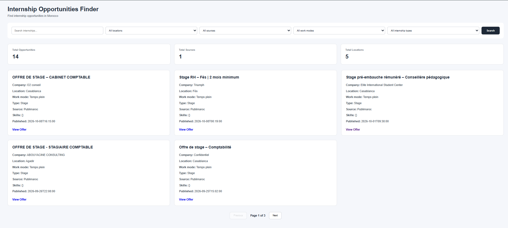

# Internship Opportunities Data Pipeline




An automated data engineering and web application project that collects internship opportunities, transforms and validates the data, stores offers in PostgreSQL, and displays them through a web dashboard. The system is designed to identify newly discovered offers and send email notifications.

## Overview

Finding internship opportunities across multiple websites can be time-consuming. This project aims to simplify the process by building an automated pipeline that collects internship listings, processes the data, stores it in a database, and makes the results accessible through a dashboard.

The application combines web scraping, data transformation, database management, backend API development, frontend visualization, and containerization.

## Key Features

* **Automated Web Scraping:** Collect internship listings using Scrapy.
* **Data Cleaning and Validation:** Normalize collected data and validate required fields before loading.
* **PostgreSQL Database:** Store internship opportunities in a relational database.
* **Duplicate Prevention:** Identify existing offers using unique identifiers to avoid inserting duplicate records.
* **New Offer Detection:** Detect newly inserted internship opportunities.
* **Email Notifications:** Send email notifications when new offers are successfully stored.
* **REST API:** Retrieve internship listings, locations, and statistics through FastAPI.
* **Interactive Dashboard:** Browse, search, filter, and paginate internship opportunities.
* **Scheduled Execution:** Run the pipeline automatically at 30-minute intervals using Docker Compose.
* **Dockerized Architecture:** Run the application services in containers.

## Architecture

```text
Internship Websites
        |
        v
   Scrapy Spiders
        |
        v
     Raw Data
        |
        v
 Data Transformation
 Cleaning & Validation
        |
        v
 Processed JSON Data
        |
        v
 PostgreSQL Database
        |
        +--------------------+
        |                    |
        v                    v
   FastAPI Backend     New Offer Detection
        |                    |
        v                    v
  Web Dashboard        Email Notifications
```

Docker Compose manages the application's services, including PostgreSQL, the backend, the frontend, and the scheduled pipeline.

## Technology Stack

| Component             | Technology                    |
| --------------------- | ----------------------------- |
| Programming Language  | Python                        |
| Web Scraping          | Scrapy                        |
| Data Processing       | Python, JSON                  |
| Database              | PostgreSQL                    |
| Database Connectivity | psycopg                       |
| Backend API           | FastAPI                       |
| Frontend              | HTML, CSS, JavaScript         |
| Email Notifications   | Resend                        |
| Containerization      | Docker, Docker Compose        |
| Configuration         | Environment Variables, `.env` |

## Project Structure

```text
Internship-Opportunities-Data-Pipeline/
├── backend/
│   ├── app/
│   │   ├── database/
│   │   ├── services/
│   │   └── main.py
│   ├── Dockerfile
│   └── requirements.txt
├── frontend/
│   ├── index.html
│   ├── style.css
│   ├── app.js
│   └── Dockerfile
├── pipeline/
│   ├── jobs/
│   │   └── run_pipeline.py
│   ├── load/
│   │   └── load_to_postgres.py
│   ├── notifications/
│   │   └── email_service.py
│   ├── scraper/
│   │   ├── spiders/
│   │   ├── items.py
│   │   ├── pipelines.py
│   │   ├── settings.py
│   │   └── Dockerfile
│   └── transform/
│       └── transform.py
├── data/
│   ├── raw/
│   └── processed/
├── tests/
├── docker-compose.yml
├── .gitignore
└── README.md
```

## Data Pipeline

### 1. Extract

Scrapy collects internship listings from supported websites. The extracted data is saved as raw JSON for subsequent processing.

### 2. Transform

The transformation stage cleans text fields, normalizes date values, validates required fields, and prepares records for database loading.

### 3. Load

The loading stage inserts processed records into PostgreSQL. Existing records are handled through conflict detection to prevent duplicate insertions.

### 4. Detect New Opportunities

The loader identifies newly inserted records and triggers an email notification for each new offer.

### 5. Serve Data

FastAPI exposes endpoints that allow the frontend to retrieve internship listings, available locations, and dashboard statistics.

### 6. Schedule Execution

Docker Compose runs the pipeline periodically, with a configured interval of 30 minutes.

## Database

The PostgreSQL database stores internship information, including:

* Internship title and company
* Location and work mode
* Internship type and stipend
* Description and skills
* Publication date and application deadline
* Application URL and source website
* Scraping timestamp

Each internship is associated with a unique identifier to support duplicate prevention.

## API Endpoints

| Endpoint           | Description                   |
| ------------------ | ----------------------------- |
| `GET /`            | API welcome endpoint          |
| `GET /internships` | Retrieve internship listings  |
| `GET /locations`   | Retrieve available locations  |
| `GET /stats`       | Retrieve dashboard statistics |

The API runs locally on port `8000` by default.

## Getting Started

### Prerequisites

Install the following tools before running the project:

* [Docker Desktop](https://www.docker.com/products/docker-desktop/)
* Git
* A Resend account and API key for email notifications

### 1. Clone the Repository

```bash
git clone <YOUR_GITHUB_REPOSITORY_URL>
cd Internship-Opportunities-Data-Pipeline
```

Replace the repository URL with the actual URL of your GitHub repository.

### 2. Configure Environment Variables

Create a `.env` file in the project root:

```env
RESEND_API_KEY=your_resend_api_key
EMAIL_FROM=your_verified_sender
EMAIL_TO=your_email_address
```

Use valid sender details supported by your Resend account. Never commit the `.env` file or expose API keys publicly.

Database settings are configured through Docker Compose.

### 3. Build and Start the Application

```bash
docker compose up -d --build
```

### 4. Access the Application

Once the services have started, open:

* **Dashboard:** http://localhost:5500
* **API:** http://localhost:8000
* **API Documentation:** http://localhost:8000/docs

### 5. Monitor the Services

Check running containers:

```bash
docker compose ps
```

View scheduler logs:

```bash
docker compose logs -f scheduler
```

View backend logs:

```bash
docker compose logs -f backend
```

Stop the application:

```bash
docker compose down
```

To stop the application without deleting the named database volume, do not add the `-v` option.

## Current Data Source

The initial implementation uses Publimaroc as its working internship source. Additional sources can be integrated when their website structure, accessibility, and scraping permissions have been verified.

Scraping behavior depends on each website's availability and access restrictions. The project should respect website terms of service and `robots.txt` rules.

## Future Improvements

* Integrate additional permitted internship sources.
* Add automated tests for scraping, transformation, and loading.
* Improve email delivery reliability with retry handling.
* Add more advanced filtering and sorting options.
* Improve monitoring, logging, and error reporting.
* Introduce data quality metrics and pipeline execution history.
* Add CI/CD automation.

## Learning Objectives

This project provides practical experience with:

* ETL pipeline design and implementation
* Web scraping with Scrapy
* Data cleaning and validation
* PostgreSQL database operations
* Duplicate detection and incremental data loading
* REST API development with FastAPI
* Frontend and backend integration
* Email service integration
* Docker-based deployment and scheduling

## Author

**Chaymae Hanini**

Master's Student in Big Data and Intelligent Systems
Interested in Data Engineering, Data Pipelines, and Intelligent Data Applications.

* LinkedIn: [chaymae-hanini](https://www.linkedin.com/in/chaymae-hanini/)

## License

This project is intended for educational and portfolio purposes. Add a `LICENSE` file if you choose to distribute it under a specific open-source license.
